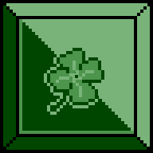
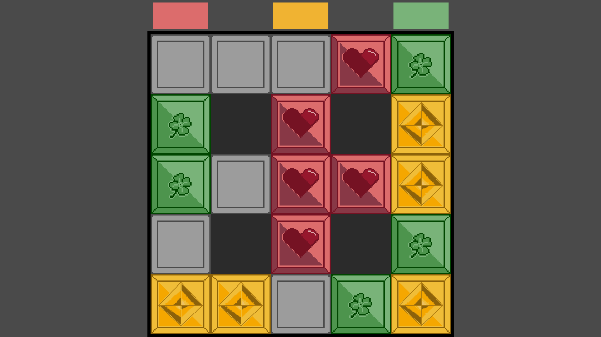

# Three color game
## How to build and launch
1. Download and build [SFML](https://www.sfml-dev.org/download.php). (Assure that SFML compatible with your compiler).
2.  Add sfml dll's to the project root directory. 
3.  Compile with command :
``` bash
g++.exe -g main.cpp -o main.exe \
-I path_to_sfml/include  \
-L path_to_sfml_binaries/lib \
-lsfml-graphics -lsfml-window \
-lsfml-audio -lsfml-network \
-lsfml-system

```
4.  Launch the exe-file
5.  Enjoy!

## Description
Game started in 2021.
Not finished.

Given a field of 5 * 5 cells and 15 cards of three colors(red, yellow and green: five of each color). 
Each cell of the field can be either blocked, or occupied by one card of any color, or free.
All the cards are on the field, 6 cells are blocked and 4 cells are free. 
Blocked cells are not interactable. 
We can move the card to the nearest cell horizontally or vertically. 
It is required, by moving the cards, to put them in three vertical rows, according to the colors standing above the field.

## Screenshots
### Three cards of each color
#### Green


#### Red


#### Yellow


### Field with cards


